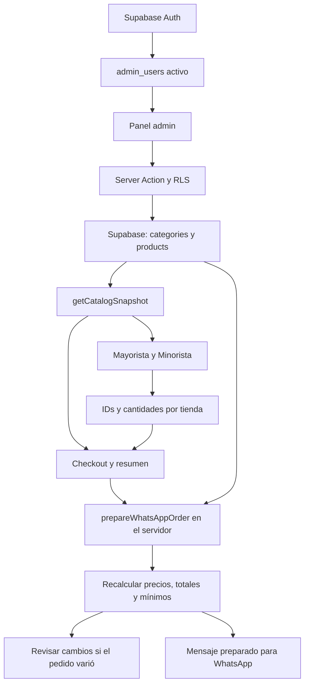

# Administración y despliegue — Fiambrería Hamdan

## Circuito comercial



Las tiendas y `/pedido/[mode]` consultan Supabase en cada carga. Las consultas y `/api/catalog` usan `no-store`. Las pestañas visibles actualizan el catálogo cada 30 segundos y al recuperar foco o conexión. El servidor vuelve a consultarlo en cada intento de envío, incluidas las reaperturas de WhatsApp. Si cambió un precio, una regla o un producto del pedido, se actualiza el resumen y se solicita revisión antes de continuar.

`localStorage` guarda únicamente IDs y cantidades; los datos del cliente quedan en `sessionStorage`. Nunca se acepta un precio o subtotal del navegador. Se ignoran o eliminan IDs desconocidos, sin precio para la tienda, inactivos, sin disponibilidad o con categoría inactiva. Ante una caída de Supabase se ofrece reintentar; la lista histórica de `src/data/catalog.ts` queda para pruebas y valores predeterminados de utilidades, y no sustituye el catálogo comercial.

WhatsApp continúa siendo una solicitud de pedido: el cliente envía el mensaje y el negocio confirma disponibilidad, total final y envío. El mensaje puede editarse en WhatsApp y no equivale a una orden persistida ni a un pago.

## Variables de Vercel

Agregar estas dos variables con los valores del proyecto Supabase, en el entorno **Production** y en **Preview** si se usa la misma base:

| Variable | Valor que corresponde |
| --- | --- |
| `NEXT_PUBLIC_SUPABASE_URL` | URL del proyecto |
| `NEXT_PUBLIC_SUPABASE_PUBLISHABLE_KEY` | Publishable key del proyecto |

No agregar `service_role`, una secret key ni contraseña de base. No se necesitan variables privadas adicionales para el panel. Las variables `NEXT_PUBLIC_*` se incorporan durante el build: después de configurarlas hay que desplegar esta rama una vez. Los siguientes cambios de precios o disponibilidad no requieren commit ni redeploy.

El login utiliza correo y contraseña; no necesita Google, un callback OAuth ni Mercado Pago. Para futuros correos de recuperación, configurar el Site URL de Supabase Auth con `https://fiambreriahamdan.com` y revisar los redirects permitidos. Este cambio no modifica DNS ni el dominio.

## SQL y seguridad

La migración [`20261003030722_harden_catalog_administration.sql`](./supabase/migrations/20261003030722_harden_catalog_administration.sql) **ya fue aplicada al proyecto existente**. Su versión local coincide con el historial remoto. No volver a ejecutarla ni usar `supabase db reset`: el repositorio no contiene una migración inicial de las tablas existentes.

La migración:

- conserva RLS habilitado;
- retira permisos de `TRUNCATE` que RLS no protege;
- limita las escrituras comerciales del panel a precios, `wholesale_same_price`, `active` e `in_stock` (la extensión de imágenes descrita abajo agrega sus dos columnas);
- impide que un usuario cree o cambie su propia membresía administrativa;
- cambia `public.is_admin()` a `SECURITY INVOKER`, con lectura de la membresía propia y sin recursión;
- permite editar a los roles existentes `owner`, `admin` y `editor`, siempre activos, y bloquea sesiones Auth anónimas;
- exige autorización en `USING` y `WITH CHECK` para las actualizaciones;
- excluye productos y categorías inactivos y productos no disponibles de las lecturas públicas;
- agrega límites de precio que también rechazan `NaN` e infinito en PostgreSQL.

No cambia precios, stock, imágenes, mínimos ni usuarios. El `updated_at` existente se utiliza para detectar ediciones concurrentes y evitar sobrescribir cambios realizados desde otra sesión. Cuando sucede, el panel pide actualizar antes de guardar.

[`supabase/tests/catalog_security.sql`](./supabase/tests/catalog_security.sql) verifica lectura pública, rechazo a no administradores, ausencia de autoasignación de roles, permisos del owner, columnas permitidas y ocultación pública de productos. Todas sus escrituras se revierten con `ROLLBACK`. Se ejecutó contra la base real después de la migración.

La revisión de seguridad de Supabase ya no informa funciones `SECURITY DEFINER` expuestas. Queda la configuración de protección contra contraseñas filtradas: [guía oficial de Supabase](https://supabase.com/docs/guides/auth/password-security#password-strength-and-leaked-password-protection). Activarla desde Auth cuando esté disponible en el plan. La renovación de sesión sigue el [patrón SSR oficial](https://supabase.com/docs/guides/auth/server-side/creating-a-client?framework=nextjs) con Proxy de Next.js 16.

## Imágenes de productos

Las migraciones `20261003141744_product_image_storage.sql` y `20261003142028_qualify_product_image_upload_path.sql` ya fueron aplicadas al proyecto existente. Los nombres/versiones locales coinciden con el historial remoto. Crean el bucket público `product-images`, limitan los archivos a WebP/JPEG/PNG y 5 MB y agregan permisos de columna para `image_url`/`image_alt`. No cambian imágenes ni datos comerciales existentes.

Desde `/admin`, buscar el producto, seleccionar **Cambiar imagen**, revisar la vista previa y la descripción y pulsar **Guardar imagen**. **Quitar imagen** prepara la eliminación; **Guardar imagen** la confirma y vuelve al placeholder de categoría. Una descripción vacía usa el nombre del producto. Guardar una imagen es independiente del formulario de precios: no envía ni guarda borradores de precios, disponibilidad o activación.

La carga utiliza el cliente público de Supabase y la sesión Auth, sin `service_role`. Se valida MIME, tamaño y firma del archivo en el navegador; se comprueba que pueda decodificarse y se intenta convertir a WebP/reducir a 1600 px en su lado mayor sin recortes ni ampliaciones. Antes de guardar la referencia, el servidor vuelve a comprobar autorización, ruta, versión del producto, firma, MIME, extensión y tamaño del archivo descargado de Storage. La referencia de 1600 × 700 px es orientativa; las tarjetas conservan `16/7`, con `object-contain`, centrado y margen interior.

Las seis políticas nuevas reutilizan `public.is_admin()` y sus roles activos `owner`, `admin` y `editor`. Solo esos miembros pueden cargar, inspeccionar o eliminar archivos. Los visitantes ven los archivos mediante URLs del bucket público; no reciben permisos de escritura. Las restricciones de carga exigen `producto/UUID.ext` y un producto existente. Los objetos son inmutables: reemplazar significa subir a una ruta nueva, guardar `image_url` condicionalmente mediante `updated_at` y luego borrar el anterior. Storage impide borrar cualquier objeto todavía referenciado por un producto, incluso ante una respuesta de red incierta. No se cambian las políticas de membresía ni se permite autoasignarse un rol.

Los errores de limpieza posteriores al guardado se informan sin revertir la nueva imagen. Si se cierra una pestaña después de subir pero antes de guardar, o falla el guardado, puede quedar un archivo pendiente sin referencia. El editor conserva la ruta para reintentar y trata de limpiar la carga pendiente al seleccionar otro archivo o quitar la selección. No hay un proceso automático que elimine archivos antiguos: evita borrar archivos por antigüedad sin verificar referencias. Las fotos externas o de otros buckets quedan preservadas.

Validación realizada: `npm test`, lint, TypeScript y build; pruebas SQL con `ROLLBACK` de catálogo y Storage; rechazo de carga anónima por la API real; navegador con catálogo/Supabase real y fixtures locales de imágenes cuadradas y verticales en ambas tiendas y móvil. `supabase/tests/product_image_security.sql` habilita únicamente en su transacción el flag de protección de borrado que usa la API de Storage para probar políticas sobre metadatos ficticios; conserva RLS y revierte todas las escrituras.

La carga/reemplazo/eliminación desde una sesión real de `/admin` queda pendiente hasta disponer de credenciales administrativas. `tests/browser-product-images.mjs` incluye ese circuito, usa un producto originalmente sin imagen y restaura sus campos de imagen al terminar; se activa mediante `HAMDAN_ADMIN_EMAIL`/`HAMDAN_ADMIN_PASSWORD` en el entorno de prueba, sin imprimirlas. No se creó ninguna cuenta ni se cambiaron credenciales para probarlo. No mergear mientras esa verificación y la Preview autenticada estén pendientes.

## Cuenta administradora

La base actual ya tiene una cuenta `owner` activa. Si se conocen sus credenciales, no hace falta crear otra: ingresar en `/admin/login`.

Para dar acceso a una cuenta nueva, una persona con acceso al Dashboard realiza una única configuración:

1. En **Authentication → Users → Add user → Create new user**, crear el correo y la contraseña y confirmar el correo.
2. En **SQL Editor**, reemplazar únicamente el correo del siguiente bloque por el correo recién creado y ejecutarlo:

```sql
do $$
declare administrator_id uuid;
begin
  select id into strict administrator_id
  from auth.users
  where lower(email) = lower('CORREO_DE_LA_ADMINISTRADORA');

  insert into public.admin_users (user_id, role, active)
  values (administrator_id, 'owner', true)
  on conflict (user_id) do update
    set role = excluded.role, active = excluded.active;
end $$;
```

3. Probar `/admin/login` con esa cuenta. No compartir contraseñas por chat ni incorporarlas al repositorio.

Un usuario de Supabase Auth sin membresía activa no puede entrar ni modificar productos. Para retirar acceso, cambiar `admin_users.active` a `false` desde la administración confiable de la base; las siguientes acciones y consultas volverán a comprobarlo.

## Uso del panel por la dueña

1. Abrir `https://fiambreriahamdan.com/admin/login` e ingresar.
2. Buscar el producto o filtrar por categoría.
3. Modificar el precio minorista y/o mayorista en pesos; se admiten coma o punto y hasta dos decimales.
4. Ajustar **Activo** y **Disponible** según la disponibilidad real.
5. Presionar **Guardar cambios** y esperar el mensaje de confirmación.
6. Cerrar sesión al terminar en un dispositivo compartido.

Un precio vacío retira el producto de esa tienda; la base requiere al menos un precio por producto. Para retirarlo de ambas tiendas, desmarcar **Activo**. Un precio cero es válido y no se interpreta como un campo vacío. **Actualizar panel** vuelve a cargar los datos y descarta ediciones locales cuando el registro cambió en otra sesión.

El panel no permite modificar mínimos, membresías, nombres ni imágenes. Las fotos existentes se conservan. `image_url` e `image_alt` están conectados a `ProductMedia`, con el fallback por categoría, y Next Image acepta imágenes públicas del Storage de este proyecto. No se creó un bucket ni se cambiaron políticas de Storage.

## Verificación y límites

Archivos de la entrega, agrupados por responsabilidad:

```text
Catálogo y pedido:
  next.config.ts
  src/data/catalog.ts
  src/lib/catalog.ts
  src/lib/catalog-db.ts
  src/lib/order.ts (contrato dinámico existente, sin cambios)
  src/lib/checkout.ts
  src/lib/prepare-order.ts
  src/lib/storeCart.ts
  src/lib/useStoreCart.ts
  src/lib/useCurrentCatalog.ts
  src/lib/supabase/client.ts
  src/lib/supabase/server.ts
  src/components/StoreCatalog.tsx
  src/components/LiveStoreCatalog.tsx
  src/components/CatalogError.tsx
  src/components/checkout/CartSummary.tsx
  src/components/checkout/Checkout.tsx
  src/app/api/catalog/route.ts
  src/app/mayorista/page.tsx
  src/app/mayorista/error.tsx
  src/app/minorista/page.tsx
  src/app/minorista/error.tsx
  src/app/pedido/[mode]/page.tsx
  src/app/pedido/actions.ts
  src/app/pedido/error.tsx

Administración y seguridad:
  .gitignore
  src/proxy.ts
  src/lib/admin-auth.ts
  src/lib/admin-product.ts
  src/app/admin/layout.tsx
  src/app/admin/page.tsx
  src/app/admin/login/page.tsx
  src/app/admin/actions.ts
  src/app/admin/error.tsx
  src/app/robots.ts
  src/components/admin/AdminLoginForm.tsx
  src/components/admin/ProductManager.tsx
  supabase/migrations/20261003030722_harden_catalog_administration.sql
  supabase/tests/catalog_security.sql

Pruebas y documentación:
  tests/dynamic-catalog.test.ts
  tests/admin-product.test.ts
  tests/browser-checkout.mjs
  tests/browser-backend.mjs
  ADMIN_SETUP.md
  README.md
  BACKEND_HANDOFF.md
  CHECKOUT_QA.md
```

- 21 pruebas unitarias aprobadas, incluidas las 12 originales.
- `npm run lint`, `npx tsc --noEmit` y `npm run build`: aprobados.
- Rutas comerciales, redirección de `/pedido`, 404 de modo inválido y protección de `/admin`: comprobados con el servidor de producción local y la base real.
- Navegador Chromium: checkout mayorista/minorista, cantidades, mínimos, formularios, WhatsApp, persistencia y sincronización entre pestañas; Pixel 7 e iPhone 13 emulados sin desbordamiento.
- `tests/browser-backend.mjs`: catálogo real, login inválido rechazado por Auth, precio manipulado corregido por el servidor, precios falsos en almacenamiento ignorados y eliminación de IDs no disponibles.
- El owner confirmó manualmente el ingreso al panel local, la visualización de productos y la edición de precios. La repetición en Preview/Production y la comprobación de cierre de sesión requieren su sesión. El script permite comprobar login, guardado y logout mediante `HAMDAN_ADMIN_EMAIL` y `HAMDAN_ADMIN_PASSWORD` en el entorno del proceso; no imprime valores ni los guarda.
- Safari/WebKit y dispositivos físicos quedan pendientes. No se envían mensajes reales durante las pruebas.
- La rama está publicada en GitHub con el [PR #1 hacia main](https://github.com/Jeser0/fiambreria-hamdan/pull/1). La publicación en producción queda condicionada a la auditoría final y a verificar la Preview; consultar el PR para el estado actual del merge.

### Auditoría final del 3 de octubre de 2026

- Se repitieron las 21 pruebas, lint, TypeScript, build y ambos scripts de navegador sobre la compilación local con Supabase real: aprobados.
- La revisión del código y el escaneo heurístico del historial Git no encontraron secretos versionados ni fallos bloqueantes en catálogo, carrito, checkout o autorización.
- Las pruebas SQL de `supabase/tests/catalog_security.sql` se repitieron con `ROLLBACK`: lectura pública, bloqueo de escritura de usuarios comunes, imposibilidad de autoasignar membresías, edición autorizada, límites de precios y ocultación de productos no disponibles aprobados. No quedaron modificaciones comerciales.
- RLS está habilitado en las cuatro tablas públicas. Los permisos de actualización de `products` están limitados a las cinco columnas del panel, con autorización por membresía activa.
- El asesor de seguridad conserva una advertencia: [protección contra contraseñas filtradas desactivada](https://supabase.com/docs/guides/auth/password-security#password-strength-and-leaked-password-protection). No se alteraron credenciales ni configuración de Auth.
- Vercel informó `Ready` para la Preview inicial, pero su protección redirige los navegadores sin sesión al login de Vercel. Ese estado no sustituye la prueba funcional de la Preview: hace falta acceso autorizado antes del merge.

Para repetir navegador en Windows, usando Edge instalado y Playwright fuera de las dependencias de la aplicación:

```powershell
npm.cmd install --prefix .qa-output/browser-runtime --no-save --package-lock=false playwright
$env:HAMDAN_PLAYWRIGHT_MODULE = Join-Path (Get-Location) '.qa-output/browser-runtime/node_modules/playwright'
$env:HAMDAN_BROWSER_CHANNEL = 'msedge'
node tests/browser-checkout.mjs
node tests/browser-backend.mjs
```

Antes, ejecutar `npm run build` y `npm run start` en otra terminal. En PowerShell con ejecución de scripts restringida, usar `npm.cmd` y `npx.cmd`; no es necesario cambiar la política del sistema.
